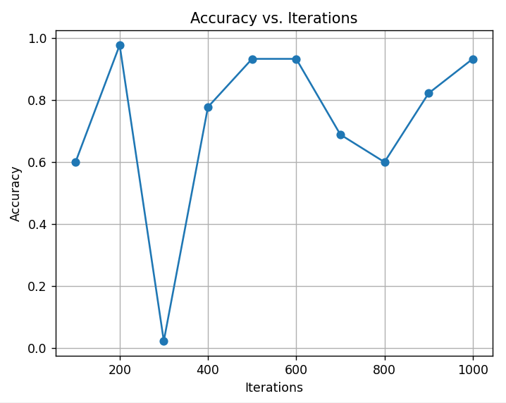

# SVM Parameter Optimization

This script performs SVM parameter optimization using scikit-learn. It iterates over multiple samples and tunes the nu and kernel parameters of the NuSVC model to achieve the best accuracy.

## Graph: Accuracy vs. Iterations

## Best Parameters and Accuracies

| Sample | Best Accuracy | Best Nu   | Best Kernel |
|--------|---------------|-----------|-------------|
| S1     | 0.600         | 0.366882  | rbf         |
| S2     | 0.977778      | 0.135743  | poly        |
| S3     | 0.022222      | 0.182227  | linear      |
| S4     | 0.777778      | 0.229282  | rbf         |
| S5     | 0.933333      | 0.251406  | linear      |
| S6     | 0.933333      | 0.208867  | linear      |
| S7     | 0.688889      | 0.125996  | poly        |
| S8     | 0.600         | 0.295665  | linear      |
| S9     | 0.822222      | 0.067916  | poly        |
| S10    | 0.933333      | 0.345811  | rbf         |

## Usage

1. Clone the repository.
2. Install the required dependencies using `pip install -r requirements.txt`.
3. Run the script to perform SVM parameter optimization.
4. View the accuracy vs. iterations graph and the best parameters and accuracies obtained for each sample.
